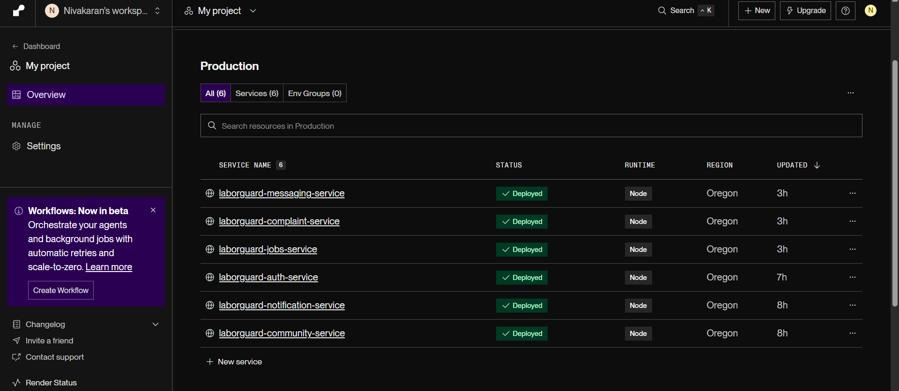
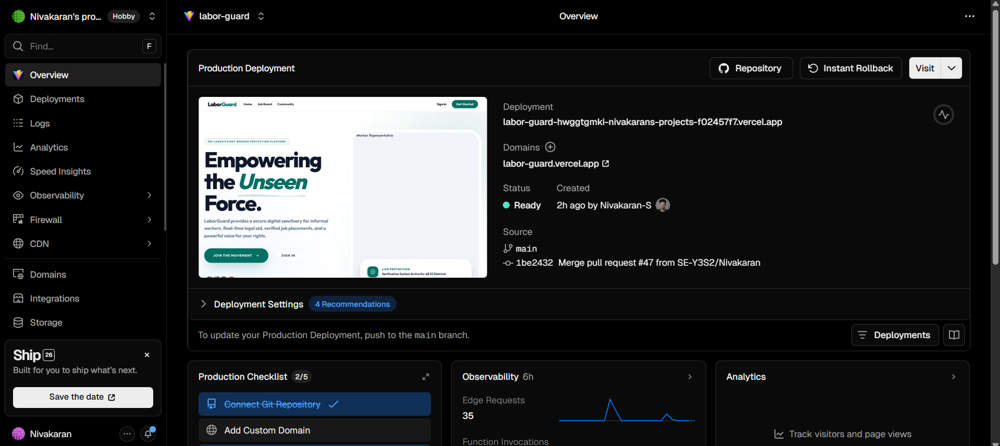

# LaborGuard 🛡️

> **SDG 8: Decent Work and Economic Growth** — A microservices-based full-stack web application that protects the rights of informal workers by connecting them with legal aid, NGOs, employers, and a support community.

***

## 🔗 Live URLs

| Resource | URL |
|---|---|
| **Frontend (Vercel)** | [labor-guard.vercel.app](https://labor-guard.vercel.app) |
| **Auth Service (Render)** | [laborguard-auth-service.onrender.com](https://laborguard-auth-service.onrender.com) |
| **Community Service (Render)** | [laborguard.onrender.com](https://laborguard.onrender.com) |
| **Complaint Service (Render)** | [laborguard-complaint-service.onrender.com](https://laborguard-complaint-service.onrender.com) |
| **Notification Service (Render)** | [laborguard-notification-service.onrender.com](https://laborguard-notification-service.onrender.com) |
| **Messaging Service (Render)** | [laborguard-messaging-service.onrender.com](https://laborguard-messaging-service.onrender.com) |
| **Jobs Service (Render)** | [laborguard-jobs-service.onrender.com](https://laborguard-jobs-service.onrender.com) |

> ⚠️ Render free-tier services may take ~30s to wake from cold start on first request.

***

## 📋 Table of Contents

- [Project Overview](#project-overview)
- [Architecture](#architecture)
- [Tech Stack](#tech-stack)
- [Microservices](#microservices)
- [User Roles & Portals](#user-roles--portals)
- [Setup Instructions (Local)](#setup-instructions-local)
- [Environment Variables](#environment-variables)
- [API Endpoint Documentation](#api-endpoint-documentation)
- [Testing](#testing)
- [Deployment](#deployment)
- [Project Structure](#project-structure)
- [Team](#team)

***

## 📌 Project Overview

LaborGuard is a comprehensive platform for informal worker rights protection. The system enables:

- **Workers** to file complaints, search for jobs, book legal appointments, and participate in community discussions
- **Employers** to post jobs, manage listings, and review applicants
- **Lawyers / Legal Officers** to review and manage assigned cases
- **NGOs** to monitor case trends, generate impact reports, and track worker outcomes
- **Admins** to oversee the platform, manage users and content moderation

***

## 🏗️ Architecture

```
┌────────────────────────────────────────────────────────────────────────┐
│                         React Frontend (Vite)                          │
│                  Tailwind CSS · Context API · React Router             │
└────────────────────────────┬───────────────────────────────────────────┘
                             │ HTTP / REST
┌────────────────────────────▼───────────────────────────────────────────┐
│                         Docker Network                                 │
│                                                                        │
│  ┌───────────────┐  ┌───────────────┐  ┌───────────────┐              │
│  │   MongoDB     │  │  Zookeeper    │  │    Kafka      │              │
│  │   :27017      │  │    :2181      │  │    :9092      │              │
│  └───────────────┘  └───────────────┘  └───────────────┘              │
│                                                                        │
│  ┌────────────────────────────────────────────────────────────────┐   │
│  │                        Microservices                           │   │
│  │                                                                │   │
│  │  ┌──────────────┐  ┌──────────────┐  ┌──────────────┐         │   │
│  │  │ auth-service │  │community-svc │  │complaint-svc │         │   │
│  │  │    :5001     │  │    :5002     │  │    :5003     │         │   │
│  │  └──────────────┘  └──────────────┘  └──────────────┘         │   │
│  │                                                                │   │
│  │  ┌──────────────┐  ┌──────────────┐  ┌──────────────┐         │   │
│  │  │notification  │  │ messaging-   │  │ job-service  │         │   │
│  │  │  svc :5004   │  │  svc :5005   │  │   :5006      │         │   │
│  │  └──────────────┘  └──────────────┘  └──────────────┘         │   │
│  └────────────────────────────────────────────────────────────────┘   │
└────────────────────────────────────────────────────────────────────────┘
```

Each microservice is independently containerized, connected through Kafka for async event-driven communication and a shared MongoDB instance.

***

## 🛠️ Tech Stack

| Layer | Technology |
|---|---|
| **Frontend** | React 18, Vite, Tailwind CSS, React Router v6, Context API, Axios, Sonner |
| **Backend** | Node.js, Express.js (per service) |
| **Database** | MongoDB with Mongoose ODM |
| **Messaging** | Apache Kafka + Zookeeper |
| **Auth** | JWT, Google OAuth 2.0 |
| **Containerization** | Docker, Docker Compose |
| **Testing** | Jest, Supertest, Artillery.io |
| **Third-Party APIs** | Google Perspective API (content moderation), Nodemailer (email), Gemini AI, Resend, OpenAI, Clodinary, Centrifge |

***

## 📦 Microservices

| Service | Port | Responsibility | Third-Party Integration |
|---|---|---|---|
| **auth-service** | 5001 | User registration, login, JWT, Google OAuth, role-based access | Google OAuth 2.0 |
| **community-service** | 5002 | Community feed posts, statuses, user profiles, advocacy hub | Google Perspective API |
| **complaint-service** | 5003 | Worker complaints lifecycle, appointments management, email notifications, legal case assignment | Nodemailer (Gmail) |
| **notification-service** | 5004 | Push/in-app notifications via Kafka events | — |
| **messaging-service** | 5005 | Real-time actor-to-actor chat | — |
| **job-service** | 5006 | Job listings CRUD, applicant management, PDF generation | PDFKit |

***

## 👥 User Roles & Portals

| Role | Dashboard | Key Capabilities |
|---|---|---|
| `worker` | `/worker/dashboard` | File complaints, job board, appointments, community |
| `employer` | `/employer/dashboard` | Post/manage jobs, review applicants |
| `lawyer` | `/legal/dashboard` | Review cases, manage appointments |
| `ngo` | `/ngo/dashboard` | Case monitoring, impact reports |
| `admin` | `/admin/dashboard` | Platform management, complaint board, user oversight |

***

## 🚀 Setup Instructions (Local)

### Prerequisites

- [Docker Desktop](https://docs.docker.com/desktop/) installed and running
- [Node.js 18+](https://nodejs.org/) (for frontend dev server)
- Git

### 1. Clone the Repository

```bash
git clone https://github.com/SE-Y3S2/LaborGuard.git
cd LaborGuard
```

### 2. Configure Environment Variables

Copy the example env file for each service and fill in your secrets:

```bash
# Backend — create .env in each service directory
cp backend/services/auth-service/.env.example backend/services/auth-service/.env
cp backend/services/community-service/.env.example backend/services/community-service/.env
cp backend/services/complaint-service/.env.example backend/services/complaint-service/.env
cp backend/services/notification-service/.env.example backend/services/notification-service/.env
cp backend/services/messaging-service/.env.example backend/services/messaging-service/.env
cp backend/services/job-service/.env.example backend/services/job-service/.env

# Frontend
cp frontend/.env.example frontend/.env
```

### 3. Start All Backend Services

```bash
# From the root directory
docker compose up --build
```

All 6 microservices + MongoDB + Kafka will start automatically.

### 4. Start the Frontend (Dev Mode)

```bash
cd frontend
npm install
npm run dev
```

Frontend is available at: **http://localhost:3000**

### 5. Verify Services Are Running

```bash
curl http://localhost:5001/health   # auth-service
curl http://localhost:5002/health   # community-service
curl http://localhost:5003/health   # complaint-service
curl http://localhost:5004/health   # notification-service
curl http://localhost:5005/health   # messaging-service
curl http://localhost:5006/health   # job-service
```

### Stop All Services

```bash
docker compose down        # stop containers
docker compose down -v     # stop + remove volumes
```

***

## 🔐 Environment Variables

> ⚠️ Never commit actual secrets. Use `.env.example` files as templates.

### auth-service

```env
PORT=5001
MONGODB_URI=mongodb://mongodb:27017/laborguard-auth
JWT_SECRET=your_jwt_secret_here
JWT_EXPIRES_IN=7d
GOOGLE_CLIENT_ID=your_google_client_id
GOOGLE_CLIENT_SECRET=your_google_client_secret
GOOGLE_CALLBACK_URL=http://localhost:5001/api/auth/google/callback
FRONTEND_URL=http://localhost:3000
KAFKA_BROKER=kafka:9092
```

### community-service

```env
PORT=5002
MONGODB_URI=mongodb://mongodb:27017/laborguard-community
KAFKA_BROKER=kafka:9092
PERSPECTIVE_API_KEY=your_perspective_api_key
```

### complaint-service

```env
PORT=5003
MONGODB_URI=mongodb://mongodb:27017/laborguard-complaints
KAFKA_BROKER=kafka:9092
EMAIL_USER=your_email@gmail.com
EMAIL_PASS=your_app_password
```

### notification-service

```env
PORT=5004
MONGODB_URI=mongodb://mongodb:27017/laborguard-notifications
KAFKA_BROKER=kafka:9092
```

### messaging-service

```env
PORT=5005
MONGODB_URI=mongodb://mongodb:27017/laborguard-messaging
KAFKA_BROKER=kafka:9092
```

### job-service

```env
PORT=5006
MONGODB_URI=mongodb://mongodb:27017/laborguard-jobs
KAFKA_BROKER=kafka:9092
```

### frontend

```env
VITE_AUTH_SERVICE_URL=http://localhost:5001
VITE_COMMUNITY_SERVICE_URL=http://localhost:5002
VITE_COMPLAINT_SERVICE_URL=http://localhost:5003
VITE_NOTIFICATION_SERVICE_URL=http://localhost:5004
VITE_MESSAGING_SERVICE_URL=http://localhost:5005
VITE_JOB_SERVICE_URL=http://localhost:5006
VITE_GOOGLE_CLIENT_ID=your_google_client_id
```

***

## 📡 API Endpoint Documentation

> Full Postman Collection: *(add your published Postman link here)*  
> Base URLs (local): `http://localhost:{port}/api`

### 🔑 Auth Service (Port 5001)

| Method | Endpoint | Auth | Description |
|---|---|---|---|
| `POST` | `/api/auth/register` | ❌ | Register a new user |
| `POST` | `/api/auth/login` | ❌ | Login with email/password → returns JWT |
| `POST` | `/api/auth/verify-email` | ❌ | Verify email OTP |
| `POST` | `/api/auth/forgot-password` | ❌ | Send password reset link |
| `POST` | `/api/auth/reset-password` | ❌ | Reset password with token |
| `GET` | `/api/auth/google` | ❌ | Initiate Google OAuth flow |
| `GET` | `/api/auth/google/callback` | ❌ | Google OAuth callback |
| `GET` | `/api/auth/me` | ✅ JWT | Get current user profile |
| `PUT` | `/api/auth/me` | ✅ JWT | Update profile |
| `GET` | `/api/users` | ✅ Admin | List all users |
| `DELETE` | `/api/users/:id` | ✅ Admin | Delete a user |
| `GET` | `/health` | ❌ | Health check |

**Register Request Example:**
```json
POST /api/auth/register
{
  "name": "John Doe",
  "email": "john@example.com",
  "password": "SecurePass123!",
  "role": "worker"
}
```
**Response (201):**
```json
{
  "message": "Registration successful. Please verify your email.",
  "userId": "64f3a..."
}
```

***

### 🤝 Community Service (Port 5002)

| Method | Endpoint | Auth | Description |
|---|---|---|---|
| `GET` | `/api/community/feed` | ✅ JWT | Get community feed posts |
| `POST` | `/api/community/posts` | ✅ JWT | Create a new post |
| `PUT` | `/api/community/posts/:id` | ✅ JWT (owner) | Update post |
| `DELETE` | `/api/community/posts/:id` | ✅ JWT (owner/admin) | Delete post |
| `POST` | `/api/community/posts/:id/like` | ✅ JWT | Like a post |
| `GET` | `/api/community/statuses` | ✅ JWT | Get user statuses |
| `POST` | `/api/community/statuses` | ✅ JWT | Create status update |
| `GET` | `/api/community/profiles/:userId` | ✅ JWT | Get user profile |
| `PUT` | `/api/community/profiles/:userId` | ✅ JWT (owner) | Update user profile |
| `GET` | `/health` | ❌ | Health check |

**Create Post Request Example:**
```json
POST /api/community/posts
Authorization: Bearer <token>
{
  "content": "Looking for support regarding wage theft...",
  "category": "legal-aid"
}
```
**Response (201):**
```json
{
  "_id": "65a1b...",
  "content": "Looking for support regarding wage theft...",
  "author": { "name": "John Doe", "role": "worker" },
  "createdAt": "2026-04-11T14:00:00Z"
}
```

***

### 📋 Complaint Service (Port 5003)

| Method | Endpoint | Auth | Description |
|---|---|---|---|
| `GET` | `/api/complaints` | ✅ Admin/Lawyer | Get all complaints |
| `GET` | `/api/complaints/my` | ✅ Worker | Get own complaints |
| `POST` | `/api/complaints` | ✅ Worker | File a new complaint |
| `GET` | `/api/complaints/:id` | ✅ JWT | Get complaint details |
| `PUT` | `/api/complaints/:id` | ✅ JWT | Update complaint |
| `DELETE` | `/api/complaints/:id` | ✅ Admin | Delete complaint |
| `PUT` | `/api/complaints/:id/assign` | ✅ Admin | Assign lawyer to complaint |
| `PUT` | `/api/complaints/:id/status` | ✅ Lawyer/Admin | Update complaint status |
| `POST` | `/api/appointments` | ✅ Worker | Book a legal appointment |
| `GET` | `/api/appointments` | ✅ JWT | Get appointments |
| `GET` | `/health` | ❌ | Health check |

---

### ⚡ Auto-Booking Behavior

- When an admin updates a complaint status to `under_review`, the system:
  - Checks eligibility (category + priority)
  - Automatically creates a legal appointment
  - Assigns a legal officer based on specialization (round-robin)
  - Sends notifications to worker and legal officer

**File Complaint Request Example:**
```json
POST /api/complaints
Authorization: Bearer <token>
{
  "title": "Unpaid wages for March 2026",
  "description": "My employer has not paid me for 3 months...",
  "category": "wage-theft",
  "employer": "XYZ Company Pvt Ltd"
}
```
**Response (201):**
```json
{
  "_id": "66b2c...",
  "title": "Unpaid wages for March 2026",
  "status": "pending",
  "ticketNumber": "LG-2026-001",
  "createdAt": "2026-04-11T14:00:00Z"
}
```

***

### 🔔 Notification Service (Port 5004)

| Method | Endpoint | Auth | Description |
|---|---|---|---|
| `GET` | `/api/notifications` | ✅ JWT | Get notifications for current user |
| `PUT` | `/api/notifications/:id/read` | ✅ JWT | Mark notification as read |
| `PUT` | `/api/notifications/read-all` | ✅ JWT | Mark all notifications as read |
| `DELETE` | `/api/notifications/:id` | ✅ JWT | Delete notification |
| `GET` | `/health` | ❌ | Health check |

***

### 💬 Messaging Service (Port 5005)

| Method | Endpoint | Auth | Description |
|---|---|---|---|
| `GET` | `/api/messages/conversations` | ✅ JWT | Get all conversations |
| `GET` | `/api/messages/:conversationId` | ✅ JWT | Get messages in a conversation |
| `POST` | `/api/messages` | ✅ JWT | Send a message |
| `DELETE` | `/api/messages/:id` | ✅ JWT (owner) | Delete a message |
| `GET` | `/health` | ❌ | Health check |

***

### 💼 Job Service (Port 5006)

| Method | Endpoint | Auth | Description |
|---|---|---|---|
| `GET` | `/api/jobs` | ❌ | Get all job listings (with filters, pagination) |
| `GET` | `/api/jobs/:id` | ❌ | Get job details |
| `POST` | `/api/jobs` | ✅ Employer | Create job listing |
| `PUT` | `/api/jobs/:id` | ✅ Employer (owner) | Update job listing |
| `DELETE` | `/api/jobs/:id` | ✅ Employer/Admin | Delete job listing |
| `POST` | `/api/jobs/:id/apply` | ✅ Worker | Apply for a job |
| `GET` | `/api/jobs/:id/applicants` | ✅ Employer | Get applicants for job |
| `GET` | `/api/jobs/:id/report` | ✅ Employer | Download job report (PDF) |
| `GET` | `/health` | ❌ | Health check |

**Filter Jobs Example:**
```
GET /api/jobs?category=construction&location=Colombo&page=1&limit=10
```
**Response (200):**
```json
{
  "jobs": [...],
  "total": 45,
  "page": 1,
  "totalPages": 5
}
```

***

## 🧪 Testing

### Running All Tests

```bash
cd backend/services/<service-name>
npm test
```

***

### Unit Tests

Tests validate individual functions and helpers in isolation.

**Auth Service:**
```bash
cd backend/services/auth-service
npm test
# Runs: src/tests/unit/passwordHelper.test.js
```

**Community Service:**
```bash
cd backend/services/community-service
npm test
# Runs: tests/perspectiveApi.test.js, tests/userProfileController.test.js, tests/statusController.test.js
```

**Complaint Service:**
```bash
cd backend/services/complaint-service
npm test
# Runs: tests/complaintController.test.js, tests/emailService.test.js
```

**Notification Service:**
```bash
cd backend/services/notification-service
npm test
# Runs: tests/notificationController.test.js
```

**Messaging Service:**
```bash
cd backend/services/messaging-service
npm test
# Runs: tests/messageController.test.js
```

***

### Integration Tests

Tests verify that controllers, services, and MongoDB work together end-to-end.

**Auth Service Integration:**
```bash
cd backend/services/auth-service
npm run test:integration
# Runs: src/tests/integration/auth.test.js
# Requires: MongoDB running (use docker compose up mongodb)
```

**Environment for Integration Tests:**
```env
MONGODB_URI=mongodb://localhost:27017/laborguard-test
JWT_SECRET=test_secret
```

***

### Performance Tests

Load testing using Artillery.io to validate API throughput under concurrent requests.
All 6 services have a `tests/performance/load-test.yml` config file.

**Install Artillery:**
```bash
npm install -g artillery
```

**Set environment variables for authenticated scenarios:**
```bash
# Set a valid JWT token from a logged-in test user
export LOAD_TEST_TOKEN=your_valid_jwt_token_here
export LOAD_TEST_CONV_ID=a_valid_conversation_id   # for messaging-service tests
```

**Run performance tests per service:**

```bash
# Auth Service (port 5001)
cd backend/services/auth-service
artillery run tests/performance/load-test.yml

# Community Service (port 5002)
cd backend/services/community-service
artillery run tests/performance/load-test.yml

# Complaint Service (port 5003)
cd backend/services/complaint-service
LOAD_TEST_TOKEN=<your_token> artillery run tests/performance/load-test.yml

# Notification Service (port 5004)
cd backend/services/notification-service
LOAD_TEST_TOKEN=<your_token> artillery run tests/performance/load-test.yml

# Messaging Service (port 5005)
cd backend/services/messaging-service
LOAD_TEST_TOKEN=<your_token> artillery run tests/performance/load-test.yml

# Job Service (port 5006) — public routes, no token needed
cd backend/services/job-service
artillery run tests/performance/load-test.yml
```

**Each load test config has 3 phases:**

| Phase | Duration | Arrival Rate | Purpose |
|---|---|---|---|
| Warm up | 30s | 5 req/s | Establish baseline |
| Load test | 60s | 15–25 req/s | Simulate production load |
| Stress test | 30s | 30–50 req/s | Find breaking point |

**View HTML report:**
```bash
artillery run tests/performance/load-test.yml --output report.json
artillery report report.json
```

> 📝 **Note:** Ensure all services are running locally via `docker compose up` before running load tests. Render free-tier services may throttle under high load.

***


### Testing Environment Configuration

```env
# Use a separate test database — never test against production
MONGODB_URI=mongodb://localhost:27017/laborguard-test
JWT_SECRET=test_secret_key
NODE_ENV=test
```

***

## ☁️ Deployment

### Live Service URLs

| Service | Platform | URL |
|---|---|---|
| **Frontend** | Vercel | [labor-guard.vercel.app](https://labor-guard.vercel.app) |
| **auth-service** | Render | [laborguard-auth-service.onrender.com](https://laborguard-auth-service.onrender.com) |
| **community-service** | Render | [laborguard.onrender.com](https://laborguard.onrender.com) |
| **complaint-service** | Render | [laborguard-complaint-service.onrender.com](https://laborguard-complaint-service.onrender.com) |
| **notification-service** | Render | [laborguard-notification-service.onrender.com](https://laborguard-notification-service.onrender.com) |
| **messaging-service** | Render | [laborguard-messaging-service.onrender.com](https://laborguard-messaging-service.onrender.com) |
| **job-service** | Render | [laborguard-jobs-service.onrender.com](https://laborguard-jobs-service.onrender.com) |

> ⚠️ **Cold starts:** Render free-tier services may take ~30 seconds to respond after a period of inactivity. This is expected behaviour.

***

### Frontend Deployment — Vercel

1. Go to [vercel.com](https://vercel.com) → **New Project**
2. Import GitHub repo: `SE-Y3S2/LaborGuard`
3. Set **Root Directory**: `frontend`
4. Set **Build Command**: `npm run build`
5. Set **Output Directory**: `dist`
6. Add environment variables (VITE_ prefixed), pointing to the Render service URLs above
7. Click **Deploy**

**Live Frontend:** [https://labor-guard.vercel.app](https://labor-guard.vercel.app)

**Production environment variables (Vercel dashboard):**
```env
VITE_AUTH_SERVICE_URL=https://laborguard-auth-service.onrender.com
VITE_COMMUNITY_SERVICE_URL=https://laborguard.onrender.com
VITE_COMPLAINT_SERVICE_URL=https://laborguard-complaint-service.onrender.com
VITE_NOTIFICATION_SERVICE_URL=https://laborguard-notification-service.onrender.com
VITE_MESSAGING_SERVICE_URL=https://laborguard-messaging-service.onrender.com
VITE_JOB_SERVICE_URL=https://laborguard-jobs-service.onrender.com
```

***

### Successful Deployment Evidence

#### 1. Backend Microservices (Render)


#### 2. Frontend Application (Vercel)


***

## 📁 Project Structure

```
LaborGuard/
├── docker-compose.yml
├── README.md
├── backend/
│   └── services/
│       ├── auth-service/
│       │   ├── Dockerfile
│       │   ├── package.json
│       │   ├── .env.example
│       │   └── src/
│       │       ├── index.js
│       │       ├── models/
│       │       ├── controllers/
│       │       ├── routes/
│       │       ├── middleware/
│       │       └── tests/
│       │           ├── unit/
│       │           └── integration/
│       ├── community-service/
│       │   ├── Dockerfile
│       │   ├── package.json
│       │   └── src/ + tests/
│       ├── complaint-service/
│       │   ├── Dockerfile
│       │   ├── package.json
│       │   └── src/ + tests/
│       ├── notification-service/
│       │   └── ...
│       ├── messaging-service/
│       │   └── ...
│       └── job-service/
│           └── ...
└── frontend/
    ├── package.json
    ├── vite.config.js
    ├── tailwind.config.js
    ├── .env.example
    └── src/
        ├── App.jsx
        ├── main.jsx
        ├── api/
        ├── components/
        │   ├── auth/
        │   └── layout/
        ├── contexts/
        ├── hooks/
        ├── pages/
        │   ├── public/
        │   ├── worker/
        │   ├── employer/
        │   ├── legal/
        │   ├── ngo/
        │   ├── admin/
        │   ├── community/
        │   ├── messaging/
        │   └── complaint/
        └── store/
```

***

## 👨‍💻 Team

| Member | Role | Contribtion |
|---|---|---|
| Nivakaran | Full-Stack | Community service, Frontend, Integration, Deployment |
| Kaveen | Full-Stack | Auth Service, Job Service, Frontend, Integration |
| Chenuli | Full-Stack | Complaint Service, Frontend |
| Dhushanthini | Full-Stack | Messaging Service, Notification Service, Frontend |

***

## 📜 License

This project is developed for academic purposes as part of SE3040 – Application Frameworks, SLIIT Year 3 Semester 2, 2026.